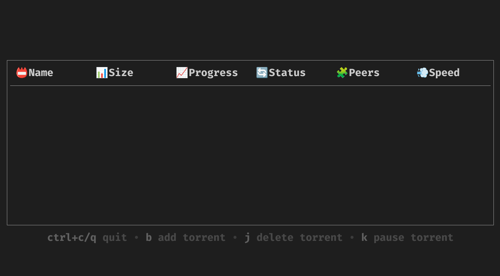

<center><h1>GOTOR</h1> </center>

The least functional and simplest torrent client you've ever seen

## Install 

#### MacOS/Linux:
```shell
make install
```
#### Windows:
Install it by hands :)
## Build

#### MacOS/Linux/Windows:
```shell
make build
```

#### Or
```shell
go build cmd/main/main.go
```

## Run tests
```shell
make test
```


## Roadmap

- [x] Pause torrents
- [ ] Add torrent by .torrent file
- [x] Add tests

## Screenshots


